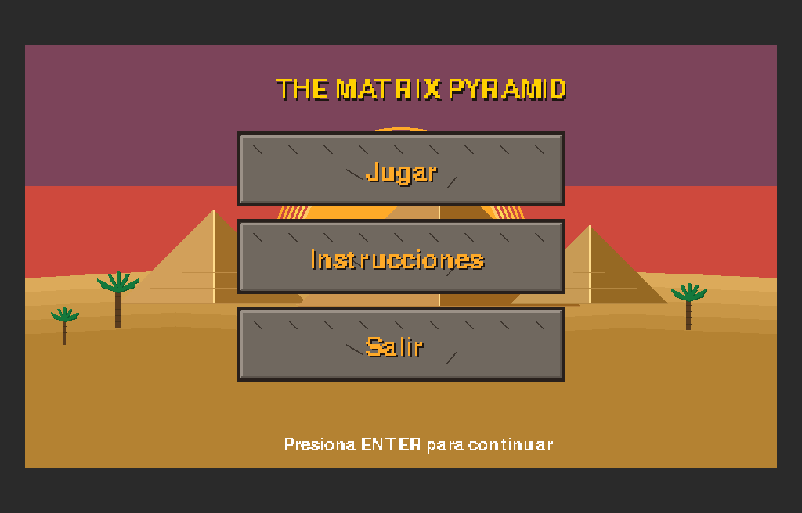
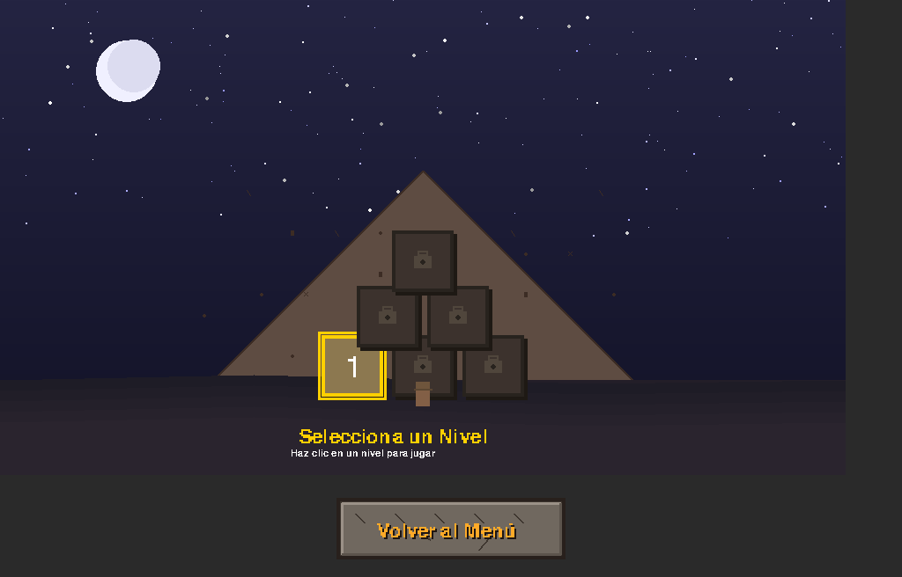
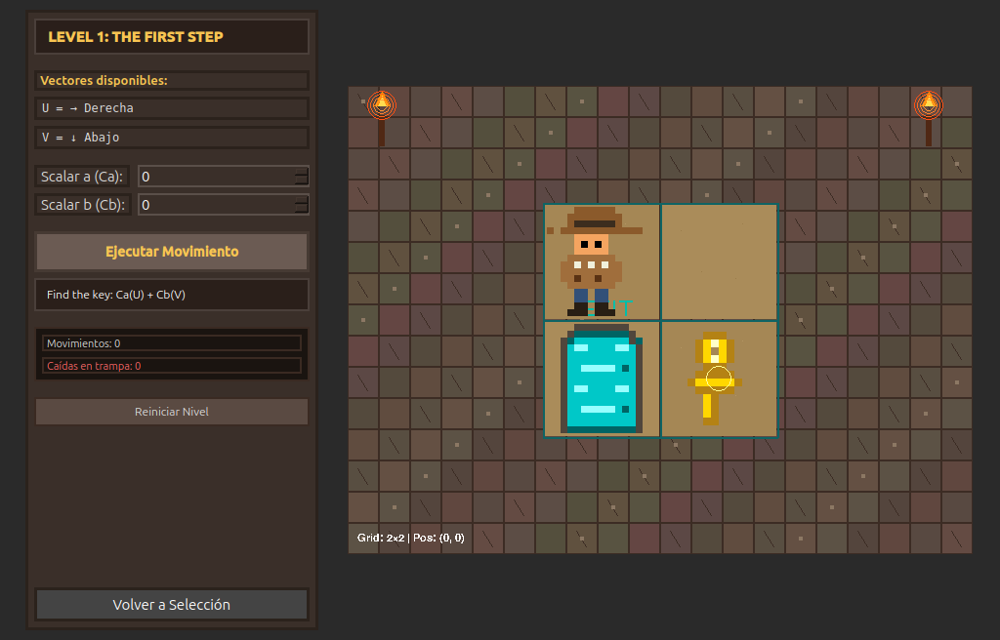
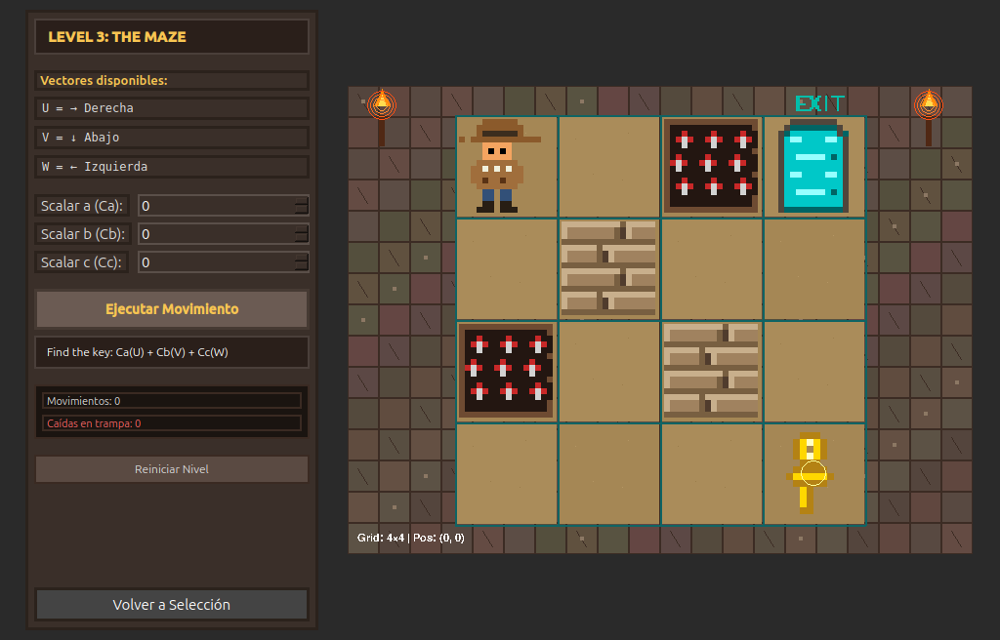

# The Matrix Pyramid (MVP)

## Información General

**Institución:** Jala U

**Proyecto:** The Matrix Pyramid

---

## Descripción del Proyecto

**The Matrix Pyramid** es un proyecto educativo desarrollado con **PyQt6** y **pygame**, enfocado en la aplicación de vectores dentro de una grilla bidimensional.

El sistema implementa:

- **Menú Principal** con fondo desértico en pixel art.
- **Selector de niveles** con pirámide nocturna y Nivel 1 habilitado.
- **Nivel 1 jugable** con grilla 4×4.
- Aplicación de combinación lineal de vectores:
  - **U = (1,0)**
  - **V = (0,1)**
- Inputs para coeficientes **Ca** y **Cb**.
- Sistema de **llave (Ankh)** y puerta **EXIT**.
- Cancelación automática si el movimiento excede los límites.

Todo el arte visual es **generado mediante código**, sin uso de assets externos.

## Galería de Capturas

| Menú Principal | Selección de Niveles |
| :---: | :---: |
|  |  |

| Jugabilidad (Nivel 1) | Jugabilidad (Nivel 3 con Trampas y Obstáculos) |
| :---: | :---: |
|  |  |

---

## Objetivo Académico

Este proyecto refuerza los siguientes conceptos:

- **Vectores en R²**
- **Combinaciones lineales**
- Representación gráfica en grillas
- Validación de límites
- Arquitectura modular de software

---

## Requisitos

```bash
python -V  # Versión 3.10 o superior recomendada
pip install -r requirements.txt
```

---

## Ejecución

```bash
python main.py
```

---

## Mecánica del Juego

1. El usuario ingresa valores enteros para **Ca** y **Cb**.
2. Se aplica la operación:

   **Ca·U + Cb·V**

3. Si el resultado permanece dentro de la grilla **4×4**, el personaje se desplaza.
4. Si excede los límites, el movimiento se cancela.
5. Es necesario recoger la **llave** antes de ingresar a la puerta **EXIT**.

---

## Arquitectura del Proyecto

El proyecto está estructurado bajo la arquitectura **Modelo-Vista-Controlador (MVC)**, lo cual permite desacoplar los datos, el renderizado de gráficos y la interfaz gráfica:

- **Modelo (Model)**: Representado por `core/game_state.py` (`GameState`) y `levels_config.py` (`LevelConfig`). Almacenan el estado interno del juego (posición del jugador, estadísticas de caídas, llaves obtenidas, estado de victoria) de manera pura sin depender de Qt o Pygame.
- **Controlador (Controller)**: Implementado en `core/game_controller.py` (`GameController`). Recibe las acciones desde la vista, ejecuta la lógica de combinación lineal de vectores, actualiza el estado y orquesta el cambio de niveles.
- **Vista (View)**: Contenida en la carpeta `screens/` y `app/`.
  - Las pantallas (`MenuPage`, `GamePage`, `LevelSelectPage`, `InstructionsPage`) son componentes PyQt6 que manejan layouts, botones y spinboxes.
  - El componente `GameRenderer` (`screens/game_renderer.py`) aísla la lógica de renderizado pixel-art en Pygame (grillas, bloques de pared, trampas con calaveras, llaves Ankh y jugador), aplicando el **Principio de Responsabilidad Única (SRP)**.

```text
the_matrix_pyramid/
│
├── app/                  # Componentes de ventana y canvas de PyQt6
├── core/                 # Constantes, estado y controladores
│   ├── game_controller.py# Controlador del juego (MVC)
│   ├── game_state.py     # Modelo del estado (MVC)
│   └── grid_logic.py     # Lógica matemática (Combinaciones lineales)
├── screens/              # Pantallas del sistema (MVC - Vistas)
│   ├── game_renderer.py  # Aislamiento de renderizado gráfico de pygame
│   └── ...               # Archivos de interfaz de usuario
├── main.py               # Punto de entrada
├── requirements.txt      # Dependencias
└── .gitignore            # Archivos excluidos del repositorio
```

---

## Tecnologías Utilizadas

- **Python**
- **PyQt6**
- **pygame**
- Programación Orientada a Objetos
- Arquitectura modular

---

 